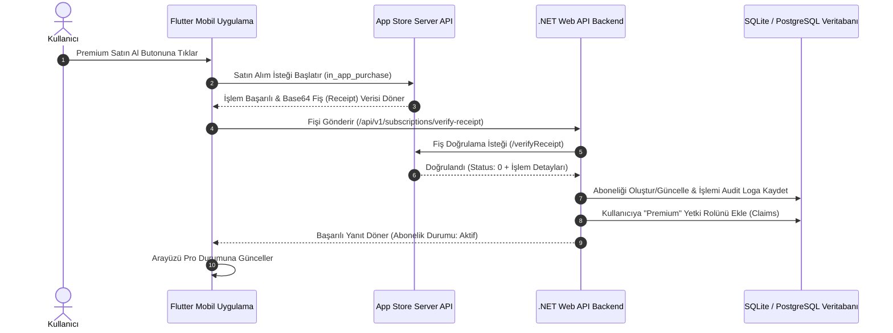

# SaaS App Store In-App Purchases (IAP) & Prompting Guide

Bu kılavuz, .NET 9.0 Clean Architecture backend ve Flutter frontend şablonları üzerine kurulmuş olan SaaS altyapısını, App Store uygulama içi satın alım (IAP) entegrasyonunu ve gelecekte bu şablonları kullanarak yeni uygulamalar yaptırırken AI asistanınıza (Antigravity) vermeniz gereken **en detaylı ve verimli prompt şablonunu** içerir.

---

## 🏛️ Mimari Yapı ve Akış

Sistem, Apple App Store StoreKit satın alım süreçlerini doğrudan uçtan uca yönetebilecek kurumsal düzeyde bir altyapıya sahiptir.



---

## ⚙️ App Store Connect & Sistem Yapılandırması

### 1. App Store Connect Ayarları
1. **Developer Portal**: Apple Geliştirici hesabınızdan App Store Connect'e gidin.
2. **Uygulama Oluşturma**: Uygulamanız için yeni bir kayıt açın ve **In-App Purchases (Uygulama İçi Satın Alımlar)** sekmesine gidin.
3. **Ürün Tanımlama**:
   - `subscription_premium_monthly` (Aylık Abonelik)
   - `subscription_premium_yearly` (Yıllık Abonelik)
   kimlikleriyle iki adet **Auto-Renewable Subscription (Otomatik Yenilenen Abonelik)** ürünü oluşturun.
4. **App-Specific Shared Secret**: Abonelik yönetim sayfasından uygulamaya özel paylaşılan şifreyi (Shared Secret) oluşturup kopyalayın.

### 2. Backend (Web API) Konfigürasyonu
`WebApi/appsettings.json` (veya üretim ortamında env değişkenleri) içerisine paylaşılan şifreyi tanımlayın:
```json
"SocialAuth": {
  "Apple": {
    "ExpectedAudience": "YOUR_APPLE_EXPECTED_AUDIENCE",
    "SharedSecret": "KOPYALADIGINIZ_APPLE_SHARED_SECRET"
  }
}
```

### 3. Webhook (Server Notifications V2) Ayarı
App Store Connect panelinde **Production Server URL** ve **Sandbox Server URL** alanlarına aşağıdaki endpoint rotanızı girin:
`https://api.sizin-alan-adiniz.com/api/v1/subscriptions/apple-webhook`

Bu sayede kullanıcı uygulamayı açmasa bile abonelik yenilendiğinde, iptal edildiğinde ya da iade yapıldığında Apple sunucuları backend API'nize doğrudan bildirim gönderir ve kullanıcının premium yetkisi anında güncellenir.

---

## 📜 Gelecekte AI Asistanına Verilecek Geliştirme Promptu

Bu şablonları kullanarak hızlıca yeni bir uygulama (örn: bir Diyet uygulaması, Borsa takip aracı, AI Chat uygulaması vb.) yazdırmak istediğinizde, **yeni bir konuşma başlatıp** asistanınıza aşağıdaki promptu doğrudan iletmelisiniz. Bu prompt, asistanın mevcut kod yapısını birebir korumasını, sisteminizi bozmamasını ve en hızlı şekilde yayına hazır (production-ready) bir uygulama teslim etmesini sağlar.

---

### 🚀 GELECEKTEKİ AGENT'LAR İÇİN PROMPT ŞABLONU (KOPYALA-YAPIŞTIR)

```markdown
Merhaba Antigravity,
Şu an geliştirmek istediğim yeni bir SaaS projesi var. Elimde hazırda duran iki adet premium template (c:\src\backend_template ve c:\src\frontend_template) bulunuyor. Bu şablonları temel alarak yeni özellikler eklemeni istiyorum.

İşte yapmak istediğim uygulamanın detayları:
1. Uygulama Adı: [UYGULAMA_ADI_BURAYA]
2. Uygulama Amacı ve Temel Özellikleri: [NE_UYGULAMASI_OLDUGU_VE_HAYAL_ETTIGINIZ_OZELLIKLERI_YAZIN]
3. Premium Özellikler: [HANGI_OZELLIKLERIN_SADECE_PREMIUM_UYE_OLANLARA_ACILACAGINI_YAZIN]

Şablonlar kurumsal mimariye (Clean Architecture ve AOP prensipleri) uygundur. Geliştirmeyi yaparken aşağıdaki KURALLARA eksiksiz uymalısın:

### 🛠️ BACKEND GELİŞTİRME KURALLARI (.NET Clean Architecture):
- **Katman Sorumlulukları**: 
  - Veritabanı Entity'lerini `Entities/Concrete` katmanında oluştur.
  - İş mantığı servislerini `Business/Concrete` ve arayüzleri `Business/Abstract` altında geliştir.
  - DAL arayüzlerini `DataAccess/Abstract` ve somut EF sınıflarını `DataAccess/Concrete/EntityFramework` altında oluştur.
  - DI kayıtları için `AutofacBusinessModule.cs` dosyasına ilgili DAL bağımlılıklarını ekle.
- **Aspect-Oriented Programming (AOP)**:
  - Eklediğin yeni CRUD metotlarının üzerine `[ValidationAspect]`, `[TransactionScopeAspect]` ve `[CacheAspect]` / `[CacheRemoveAspect]` niteliklerini (aspect'lerini) kurumsal standartlara uygun olarak mutlaka ekle.
- **Premium Yetkilendirme**:
  - Geliştirdiğin premium endpoint'lerin üzerine `[SecuredOperation("Premium,Admin")]` aspect'ini koyarak yetkisiz erişimi engelle. Sistemde hazır bulunan `UserStatusMiddleware` ve `VerifyAppleReceipt` altyapısı bu yetkiyi otomatik kontrol etmektedir.
- **Veritabanı Yapılandırması**:
  - `AppDbContext.cs` dosyasına yeni tabloları `DbSet` olarak ekle.
  - Soft delete için `HasQueryFilter(x => !x.IsDeleted)` filtresini ve sorgu performansları için gerekli indeksleri `OnModelCreating` içinde tanımla.
  - Geliştirme ortamında veritabanı bağlantısı `cleanarch_dev.db` (SQLite) olarak çalışmalıdır. Bu sayede local veritabanı otomatik migrate olup ayağa kalkar.
  - Yeni seed verilerini `DbSeeder.cs` içerisinde tanımlayarak sistemin ayağa kalktığında örnek verilerle açılmasını sağla.

### 📱 FRONTEND GELİŞTİRME KURALLARI (Flutter Provider & GetIt):
- **Temiz Mimari**:
  - Data katmanında `datasources`, `models` ve `repositories` klasörlerini kullan.
  - Domain katmanında `repositories` ve `usecases` yapılarını oluştur.
  - Presentation katmanında sayfaları `features` altında mantıksal gruplara ayır. Arayüzde premium hissettiren modern tasarım kurallarını (glassmorphism, outfit yazı tipleri, degradeler) uygula.
- **Bağımlılık Yönetimi (DI)**:
  - Yeni oluşturduğun data source, repository ve usecase'leri `service_locator.dart` dosyasına GetIt kullanarak kaydet.
- **Global Durum Yönetimi (State)**:
  - Sayfalardaki mantığı yönetmek için `providers` altında ChangeNotifier sınıfları oluştur ve bunları `main.dart` içerisindeki `MultiProvider` listesine ekle.
- **Sosyal Giriş & Profil**:
  - Hazırda bulunan Google/Apple login akışlarını bozma.
  - Kullanıcı profil sayfasında bulunan "Hesabımı Sil" ve "Paywall/Subscription" geçişlerini aktif tut.
- **Mock Veri Desteği**:
  - `AppConfig.instance.useMockData` durumuna göre veri kaynaklarında mock veri desteği sağla, böylece uygulama localde API olmadan da doğrudan arayüz testleri için çalışabilsin.

Lütfen mevcut auth, rate limiting, localization ve ödeme altyapılarını bozmadan, bu kurallara sadık kalarak projeyi adım adım geliştir ve her aşamada kodun doğruluğunu test et.
```

---

## 🔒 KVKK ve Apple Güvenlik Standartları Uyumluluğu

Uygulamanızın App Store incelemesinden sorunsuz geçebilmesi için şablonlara eklenen dört kritik özellik bulunur:

1. **Hesap Silme (Account Deletion - Kural 5.1.1(v))**: 
   - Apple App Store İnceleme Kılavuzu, kullanıcıların hesaplarını uygulama içerisinden kolayca silebilmesini zorunlu kılar.
   - Bu şablonda kullanıcı profilindeki **"Hesabımı Sil"** seçeneği doğrudan API üzerinden kullanıcının hesabını güvenli bir şekilde kapatır (`IsDeleted = true`, `Status = false`), token'ını geçersiz kılar ve oturumunu sonlandırır.
2. **Kullanıcı Durum Kontrolü (UserStatusMiddleware)**:
   - Kullanıcı hesabı silindiyse veya banlandıysa, `UserStatusMiddleware` 5 dakikalık akıllı önbellek kontrolüyle kullanıcının isteklerini anında engeller ve sisteme erişimini durdurur.
3. **Apple ile Giriş Yap (Sign in with Apple - Kural 4.8)**:
   - Herhangi bir üçüncü taraf sosyal giriş (örn: Google) sunan tüm uygulamaların Apple ile Giriş seçeneği de sunması zorunludur.
   - Giriş ekranına hem backend tarafında doğrulaması yapılan hem de frontend tarafında entegre edilmiş olan Google ve Apple ile Giriş düğmeleri eklenmiştir. `useMockData` modunda bu akışlar doğrudan simüle edilebilir.
4. **Abonelik Şartları ve Gizlilik Politikası (EULA & Privacy Policy - Kural 3.1.1)**:
   - Otomatik yenilenen abonelik sunan uygulamaların paywall ekranında açıkça Kullanım Koşulları (EULA) ve Gizlilik Politikası linkleri barındırması gerekir.
   - Satın alma ekranının (Paywall) alt kısmına, tıklandığında uygulamanın içinden açılan şık ve kurumsal EULA & Gizlilik Politikası diyalog pencereleri eklenmiştir. Bu sayede harici web sayfaları oluşturma zorunluluğu ortadan kalkar ve Apple Store inceleme testlerinden hemen geçilir.

---

## 🖥️ Web Admin Yönetim Paneli Kurulumu

Yönetim paneli, backend API'sinden tamamen izole edilmiş bağımsız bir **React + Vite** projesidir. `c:\src\admin_panel_template` klasöründe yer alır.

### Geliştirme Ortamı Çalıştırma Adımları:
1. `c:\src\admin_panel_template` dizinine gidin.
2. Bağımlılıkları yükleyin:
   ```bash
   npm install
   ```
3. Geliştirme sunucusunu başlatın:
   ```bash
   npm run dev
   ```
4. Tarayıcınızda `http://localhost:3000` adresini açarak panele erişin.
5. Varsayılan yetkili giriş bilgileri:
   - **E-Posta:** `admin@template.com`
   - **Şifre:** `Admin123!`

> [!NOTE]
> `vite.config.js` içerisine entegre edilen proxy sayesinde, `/api` üzerinden yapılan istekler otomatik olarak `http://localhost:5212` (.NET Web API) sunucunuza yönlendirilir. Local geliştirmede CORS ayarı yapmanıza gerek kalmaz.
